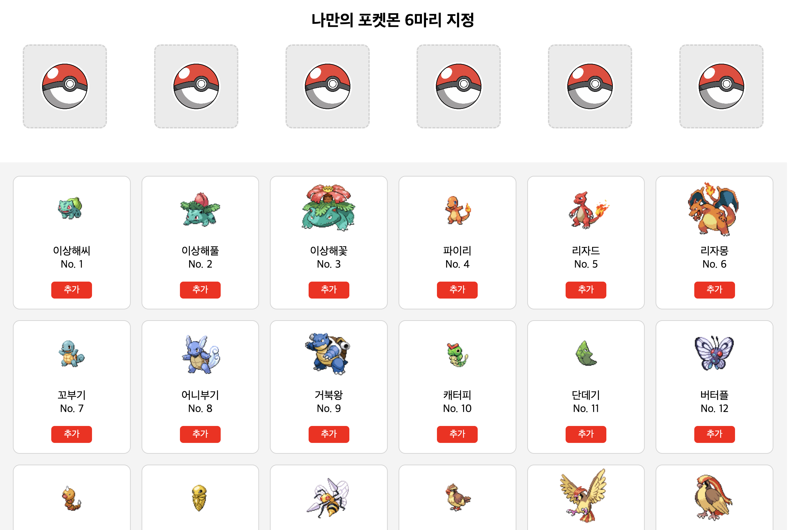

# 📁 Pokédex 포켓몬 도감 만들기

 

# 🌑 구현기능

- Routing : 리액트 라우터 돔을 활용한 페이지 간 이동
- 포켓몬 리스트 추가, 삭제 버튼
- grid를 활용한 반응형 카드
  <!-- - Query 파라미터를 이용한 페이지 이동 (디테일 페이지) _ 구현 전 -->
   

# ✔️ 추가기능

- 유효성 검사

1. 이미 추가한 포켓몬의 경우 알림
2. 추가된 포켓몬이 6마리 이상일 경우 알림

 

# 🚀 트러블슈팅

[빈배열에 해당값 지정하는 방법] [6개의 포켓몬 볼에 지정 포켓몬 넣기]()
